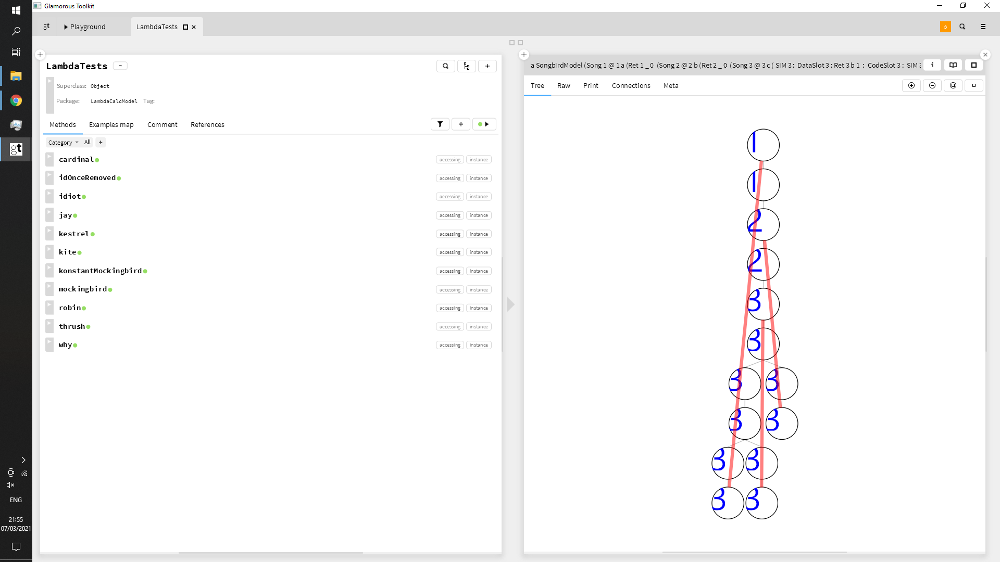

# Glamorous-Lambda-Songbirds
Trying to implement (something like) http://dkeenan.com/Lambda/ (animated lambda calculus).

# Install
Get [Glamorous Toolkit](https://gtoolkit.com/).
then:

```Smalltalk
Metacello new 
  baseline: 'Songbirds'; 
  repository: 'github://Peter-H-Meadows/Glamorous-Lambda-Songbirds';
  load.
```

```Smalltalk
SongbirdsGUI new open .

```

Right-click anywhere to access the menu.



 repository: 'github://Peter-H-Meadows/Glamorous-Lambda-Songbirds:main/src';
